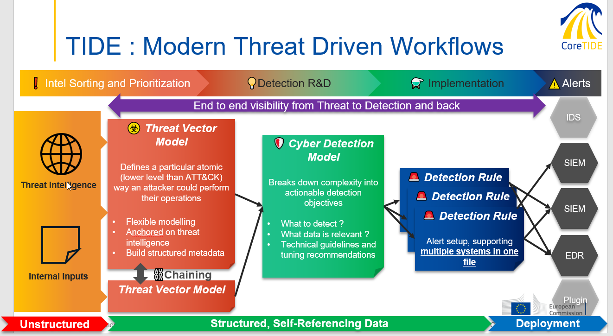

#  OpenTIDE
Open Threat-Informed Detection Engineering is the European Commission DIGIT.S2 (Cyber Security Operations Centre) open source initiative to build a rich ecosystem of tooling and data supporting Cyber Threat Detections.

### It consists of a series of projects:

#  CoreTIDE
CoreTIDE, the powerhouse powering the OpenTIDE initiative and the first DetectionOps open platform, developed at the European Commission. The [reference CoreTIDE repository](https://github.com/EC-DIGIT-CSIRC/CoreTIDE) is hosted on Github.  

A [mirror](https://code.europa.eu/ec-digit-s2/opentide/coretide) is maintained on code.europa.eu

#  StartTIDE
###### StartTIDE is a ready to use base project, providing an OpenTIDE Instance with a simple git clone. The [reference StartTIDE repository](https://code.europa.eu/ec-digit-s2/opentide/starttide) is hosted on code.europa.eu

### Overview of the OpenTIDE framework

### OpenTIDE 2.0

We have released a [white paper](https://code.europa.eu/groups/ec-digit-s2/opentide/-/wikis/uploads/e66f0f311d758449b350ff4f96105898/OpenTIDE_White_Paper.pdf) on OpenTIDE Threat Informed Detection Modelling and Engineering as-Code

More information on [EP202 Beyond Tiered SOCs: Detection as Code and the Rise of Response Engineering](https://cloud.withgoogle.com/cloudsecurity/podcast/ep202-beyond-tiered-socs-detection-as-code-and-the-rise-of-response-engineering/)
